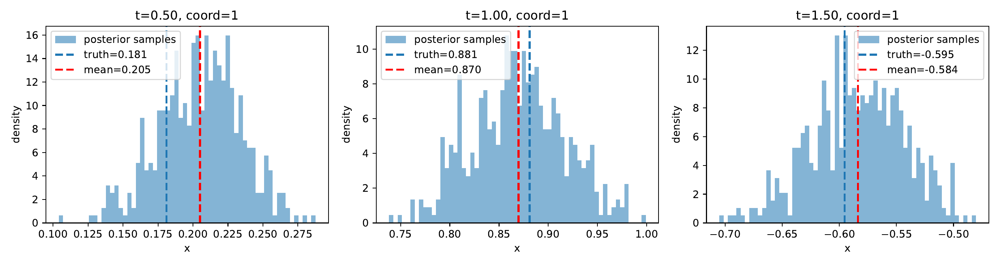
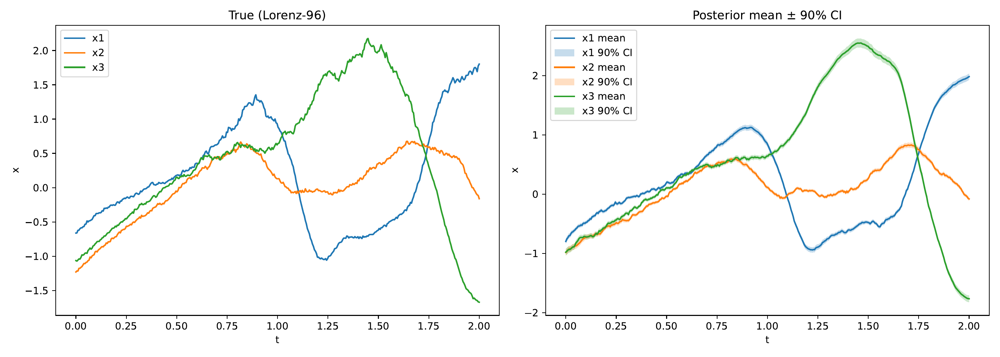

# FilteringSDEs

Neural path filtering of stochastic dynamical systems under partial observations. Code for the paper:

> Yang, Nicole Tianjiao. "Pathwise Learning of Stochastic Dynamical Systems with Partial Observations." arXiv:2601.21860 (2026).

We learn a conditional generative model that produces posterior distributions over latent trajectories, amortized over observation paths. The method handles noisy, partial, and irregularly-timed observations, and supports both filtering (causal) and smoothing (non-causal) inference at test time without retraining.

Experiments cover stochastic **Lorenz-63**, **Lorenz-96**, and **MuJoCo Hopper** data.

---

## Results

### Lorenz-96: learned posterior on 15-dimensional stochastic system

The model is trained on the time interval [0, 2] with observation model y_t = tanh(x_t) + N(0, 0.15²) and 20% missing observations during training.

**Quantitative comparison across missing rates** — model trained on [0, 3] with 20% observations masked; evaluated over 10 seeds against particle filter (PF, 512 particles) and particle smoother (PG, 512 particles). Our method uses only 64 posterior samples. **Bold** = best. Lower is better.

<table>
<thead>
<tr>
  <th>Missing Rate</th>
  <th>Method</th>
  <th>RMSE</th>
  <th>W₁</th>
</tr>
</thead>
<tbody>
<tr>
  <td rowspan="3">10%</td>
  <td>Ours</td>
  <td><b>0.141 ± 0.002</b></td>
  <td><b>0.104 ± 0.002</b></td>
</tr>
<tr>
  <td>PF</td>
  <td>0.223 ± 0.004</td>
  <td>0.128 ± 0.010</td>
</tr>
<tr>
  <td>PG</td>
  <td>0.219 ± 0.005</td>
  <td>0.106 ± 0.006</td>
</tr>
<tr>
  <td rowspan="3">30%</td>
  <td>Ours</td>
  <td><b>0.159 ± 0.002</b></td>
  <td><b>0.117 ± 0.002</b></td>
</tr>
<tr>
  <td>PF</td>
  <td>0.281 ± 0.004</td>
  <td>0.182 ± 0.016</td>
</tr>
<tr>
  <td>PG</td>
  <td>0.280 ± 0.004</td>
  <td>0.153 ± 0.020</td>
</tr>
<tr>
  <td rowspan="3">50%</td>
  <td>Ours</td>
  <td><b>0.195 ± 0.002</b></td>
  <td><b>0.137 ± 0.004</b></td>
</tr>
<tr>
  <td>PF</td>
  <td>0.377 ± 0.004</td>
  <td>0.237 ± 0.021</td>
</tr>
<tr>
  <td>PG</td>
  <td>0.378 ± 0.003</td>
  <td>0.242 ± 0.026</td>
</tr>
</tbody>
</table>

---


**Marginal posterior distributions** at t = 0.5, 1.0, 1.5 for dimension 1 — posterior samples (histogram) tightly bracket the ground-truth value (blue dashed line) across all three snapshots:



**True vs. inferred trajectories** for the first 3 dimensions, with 90% credible intervals:



---

## Dependencies

```bash
pip install -r requirements.txt
```

---

## Usage

All scripts are run from the repo root.

### Lorenz-63

**Train 5 seeds in one command** (each seed saved to `./dump/l63/seed<N>/`):

```bash
python lorenz63.py train_seeds \
    --seeds "[0,1,2,3,4]" \
    --base_dir ./dump/l63/ \
    --num_iters 500
```

**Train a single seed** (auto-names directory by seed):

```bash
python lorenz63.py train \
    --seed 0 \
    --base_dir ./dump/l63/ \
    --num_iters 500
```

---

### Lorenz-96

```bash
python lorenz96.py \
    --seed 0 \
    --missing_rate_train 0.2 \
    --missing_rate_test 0.5 \
    --train_dir ./dump/l96/
```

---

### MuJoCo Hopper (evaluation only — requires a trained checkpoint)

```bash
python mujoco.py \
    --model_ckpt ./path/to/model.pth \
    --data_dir   ./hopper_data/ \
    --out_dir    ./hopper_eval/
```

---

## Custom posterior integrator (`sdeint_obs.py`)

Standard `torchsde.sdeint` does not support passing observations into the drift at each solver step. `sdeint_obs` is a self-contained Euler-Maruyama integrator that does exactly this, acting as a drop-in replacement for `torchsde.sdeint(..., logqp=True)`:

```python
from sdeint_obs import sdeint_obs

# posterior path: observation tensor is passed to sde.f and sde.h at every step
zs, log_ratio = sdeint_obs(sde, z0, obs, ts, dt=1e-2, logqp=True, method="euler")

# prior path: unchanged, uses plain torchsde
zs = torchsde.sdeint(sde, z0, ts, dt=1e-2, method="euler")
```

The SDE class must expose:
- `f(t, y, obs)` — posterior (obs-conditioned) drift
- `h(t, y, obs)` — prior drift (only needed when `logqp=True`)
- `g(t, y)` — diagonal diffusion (no obs)
- `noise_type = "diagonal"`, `sde_type = "ito"`

---

## References

[1] Yang, Nicole Tianjiao. "Pathwise Learning of Stochastic Dynamical Systems with Partial Observations." arXiv:2601.21860 (2026).

[2] Li, Xuechen, et al. "Scalable gradients for stochastic differential equations." AISTATS 2020.
